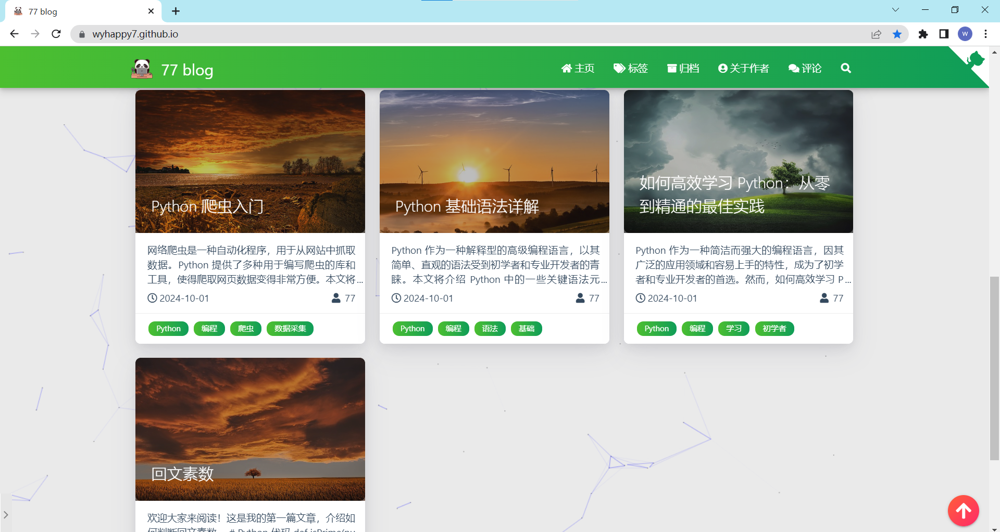
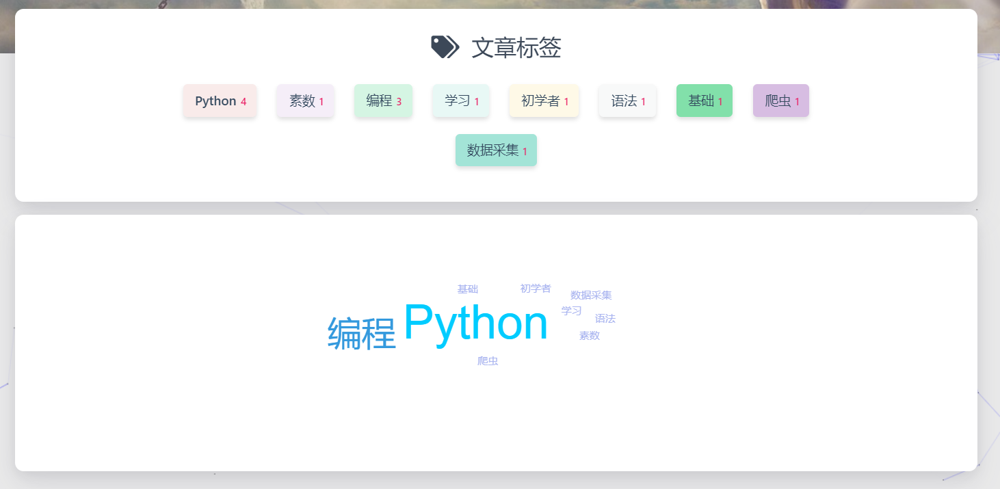
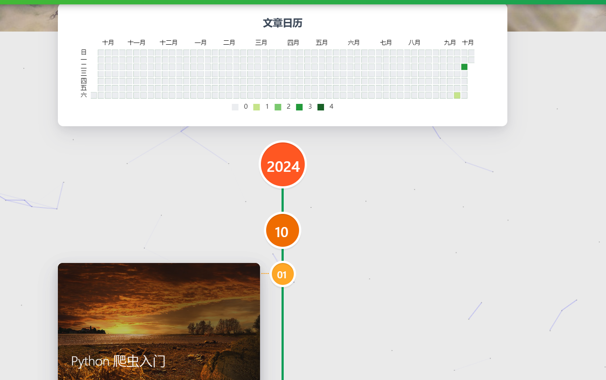

# 77 Blog
我搭建的个人博客：https://wyhappy7.github.io/

## 博客的介绍
博客的主要内容是分享一些个人的学习心得、生活感悟、工作总结等。

### 1、博客的目的   
1. 记录自己的学习心得、生活感悟、工作总结等。
2. 与同行交流，分享自己的见解。
3. 展示自己的作品，与他人进行交流。
4. 作为个人的技术博客，分享自己的技术心得。

   
### 2、博客的搭建
博客的搭建主要是利用GitHub Pages和hexo的静态博客生成器来实现的来搭建，具体的步骤如下：
1. 安装Node.js
2. 安装Git
3. 安装hexo
4. 克隆博客仓库
5. 安装依赖包
6. 对博客主题进行修改
7. 部署博客到GitHub Pages
8. 启动hexo服务
9. 编写博客文章
   
## 博客的设计
#### 1、博客首页
* 展示博客文章
* 显示统计信息、访问量、访问数等
* 回到顶部按钮：右下角显示，点击可回到页面顶部
* 左下角有音乐播放器，可播放音乐
* 展示作者的联系方式和github地址
  
#### 2、博客标签页
* 展示所有文章的标签
* 点击标签可跳转到相应标签的文章
  
#### 3、博客归档页
* 展示所有文章的归档日期
* 点击可跳转到相应日期的文章
  
#### 4、博客作者页
* 展示作者信息
* 展示作者的文章统计图表
* 展示作者的技能

#### 5、评论页
* 展示文章的评论
* 可通过gitalk插件实现评论功能
  

## 博客主要页面图

